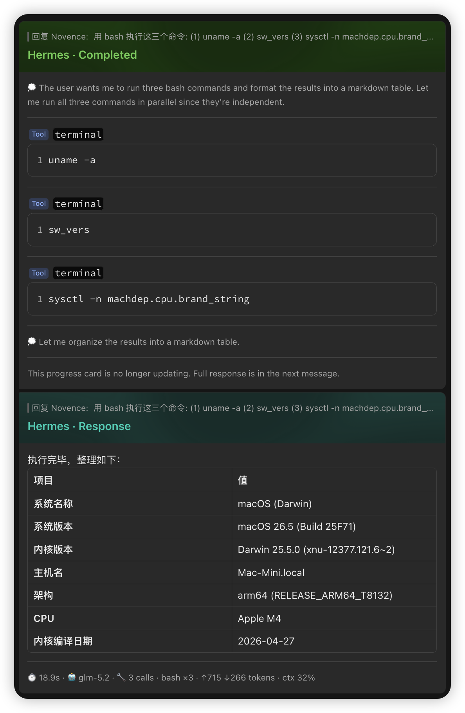

# feishu-card-progress

English | [中文](README.md)

<p align="center">
  
</p>

> **Hermes plugin for Feishu/Lark** — renders tool-execution progress and final replies as **live-updating interactive cards** instead of spamming text messages. Pure monkey-patch architecture, no extra process, works out of the box.

<p align="center">
  
</p>

<sub>One screenshot, every capability: top 🟢 <code>Completed</code> progress card (💭 reasoning + 🖥 tool-call steps) → bottom 🟦 <code>Response</code> reply card (footer with <code>⏱ 🤖 🔧 ↑↓ ctx</code> runtime stats).</sub>

---

## ✨ Features

- **Live progress card** — auto-created on tool execution, incrementally PATCHed, no message spam. Header states: 🔵 Running → 🟢 Completed / 🔴 Failed
- **Final-reply marker** — after completion, retroactively patches the final reply card with a 🟦 turquoise `Response` header to distinguish it from the progress card
- **Reasoning display** — gray 💭 notation, supports reasoning deltas from DeepSeek / Qwen / Moonshot / GLM / OpenRouter and more
- **Schema 2.0 card rendering** — Markdown replies auto-converted to interactive cards; tables / code blocks / links rendered precisely
- **Runtime-stats footer** — reply card footer shows duration, model, tool-call count (with bash breakdown), token usage, context occupancy
  - Example: `⏱ 4.2s · 🤖 glm-5.1 · 🔧 5 calls · bash ×3 · ↑1.2k ↓320 tokens · ctx 42%`
  - **Token estimation fallback** — for providers (z.ai / GLM) whose streaming returns no usage, tokens are estimated from the context compressor instead of showing a misleading `↑0 ↓0`
- **`<think>` tag fallback** — auto-strips `<think>` / `<thinking>` tags occasionally leaked by DeepSeek / Qwen
- **PATCH concurrency safety** — per-chat lock + monotonic seq stale-drop; under heavy tool use, stale snapshots never overwrite fresh content
- **Table overflow protection** — auto-splits (split) or falls back to Post messages (post) when >5 markdown tables, avoiding Feishu ErrCode 11310
- **Restart tolerance** — active card IDs are persisted; leftover cards auto-cleaned after a gateway restart
- **Reply-chain enhancement** — extracts real text when quoting a card message instead of showing `[Interactive message]`
- **root_id auto-strip** — prevents quoted replies from auto-creating topics

## 📦 Installation

```bash
# 1. Copy the plugin into the Hermes plugins dir
cp -r feishu-card-progress ~/.hermes/plugins/feishu-card-progress

# 2. Profile mode needs an extra symlink
ln -s ~/.hermes/plugins/feishu-card-progress ~/.hermes/profiles/<profile>/plugins/

# 3. Enable the plugin (profile config.yaml)
# plugins:
#   enabled:
#     - feishu-card-progress

# 4. Apply the upstream patch (1 spot, in gateway/platforms/feishu.py)
#    removes root_id as a thread_id / reply_to fallback to prevent auto topic creation

# 5. Restart the gateway
hermes gateway restart
```

## ⚙️ Configuration

| Env var | Default | Description |
|---------|---------|-------------|
| `FEISHU_PROGRESS_STYLE` | — | Set to `card` to activate; if unset, loads silently |
| `FEISHU_PROGRESS_RESPONSE_HEADER` | `true` | Set to `false` to disable the turquoise Response header on the final reply |
| `FEISHU_PROGRESS_TABLE_OVERFLOW` | `split` | `split` into multiple cards (≤5 tables/card); `post` falls back to Feishu Post (no table limit) |

## 🏗 Architecture

Pure monkey-patch — no sidecar, no extra process; directly enhances Hermes' own `FeishuAdapter` / `AIAgent`:

```text
User message
  │
  ▼
Hermes Gateway
  ├─ FeishuAdapter (8 patches)
  │   ├─ on_processing_start          clean leftover cards + reset state
  │   ├─ on_processing_complete       finalize progress card + retroactively add Response header + render footer
  │   ├─ _on_message_event            strip root_id to prevent auto topic creation
  │   ├─ send()                       intercept progress msgs → create card; split tables; track reply msg_id
  │   ├─ edit_message()               intercept progress updates → PATCH card (per-chat lock + seq stale-drop)
  │   ├─ _build_outbound_payload      Schema 2.0 card rendering / Post fallback
  │   ├─ _build_get_message_request   add raw_card_content param
  │   └─ _extract_text_from_raw_content parse card to extract quoted text
  ├─ AIAgent (2 patches)
  │   ├─ __setattr__                  capture agent instance + wrap tool_progress_callback (route reasoning)
  │   └─ _build_assistant_message     intercept reasoning extraction
  └─ Upstream patch (1 spot)
      └─ feishu.py                    remove root_id as thread_id / reply_to fallback
```

Event flow: `reasoning.available` / `tool_progress` → incremental PATCH on progress card → `on_processing_complete` → final reply → retroactively patch Response header + footer.

## 🎨 Card styles

| Card type | Header | Color |
|-----------|--------|-------|
| Progress (running) | `Hermes · Running` | 🔵 blue |
| Progress (done) | `Hermes · Completed` | 🟢 green |
| Progress (failed) | `Hermes · Failed` | 🔴 red |
| Final reply | `Hermes · Response` | 🟦 turquoise |

## ❓ FAQ

- **Card not updating / not streaming** — confirm Hermes `streaming.enabled: true` and `streaming.transport: edit`; the model must support reasoning deltas.
- **Footer tokens show 0** — the provider (z.ai / GLM) returns no usage in streaming; v1.4.0 added an estimation fallback (input from `context_compressor.last_prompt_tokens`, output ≈ reply char count ÷ 4).
- **Card content flickers/reverts under heavy tool use** — fixed in v1.4.0 via per-chat PATCH lock + seq stale-drop; make sure the plugin is updated to v1.4.0.
- **Multi-table reply fails (ErrCode 11310)** — exceeds Feishu's 5-table limit; set `FEISHU_PROGRESS_TABLE_OVERFLOW=post` to fall back to Post.
- **Final reply leaks `<think>` tags** — v1.4.0 added a `_strip_think_tags` fallback.
- **Patch lost after a Hermes update** — see "Upstream updates" below and re-apply the single feishu.py patch.

## 🔧 Upstream updates

After `git pull`-ing Hermes, check whether the single patch was overwritten:

```bash
cd ~/.hermes/hermes-agent && git pull origin main
grep -n 'root_id' gateway/platforms/feishu.py | grep -iE 'thread_id|reply_to'
# if any result, re-apply the patch
```

Or just tell an AI: **"Hermes updated, re-apply the feishu-card patch"**. See `skills/patch-upstream/SKILL.md`.

## 📊 vs cc-connect

| Feature | cc-connect | This plugin |
|---------|-----------|-------------|
| Progress card | Schema 2.0 | Schema 2.0 |
| Reasoning display | in card | in card |
| Final-reply marker | — | 🟦 turquoise Response header |
| Gateway-restart tolerance | none | persist + auto-cleanup |
| Runtime-stats footer | — | ⏱🤖🔧↑↓ctx |
| Token estimation fallback | — | ✓ (GLM / z.ai) |
| `<think>` fallback stripping | — | ✓ |
| PATCH serialization + stale-drop | — | ✓ |
| Table overflow protection | — | ✓ (split / post) |
| Streaming text preview | yes | — |
| TodoWrite icons | yes | — |

## 📜 Version history

| Version | Date | Highlights |
|---------|------|------------|
| v1.4.0 | 2026-06-19 | runtime-stats footer, token estimation fallback, `<think>` stripping, PATCH concurrency lock |
| v1.3.0 | 2026-05-23 | turquoise Response header, table overflow handling |
| v1.2.0 | 2026-05-22 | reply-to, root_id strip, clarify suppression |
| v1.1.0 | 2026-05-21 | thinking / reasoning support |
| v1.0.0 | 2026-05-20 | initial interactive card progress |

Full changelog: [CHANGELOG.md](CHANGELOG.md).

## 🧪 Tests

```bash
python3 -m unittest tests.test_card_handler -v
```

Covers `<think>` stripping, PATCH seq stale-drop, footer rendering (stdlib `unittest`, no pytest dependency).

## 📦 Dependencies

- Hermes Agent (plugin system required)
- `lark_oapi` SDK
- Feishu app configured (`FEISHU_APP_ID` / `FEISHU_APP_SECRET`)

## 📄 License

[MIT](LICENSE) © 2026 Novence
