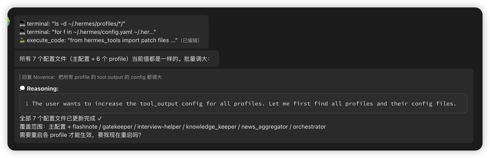
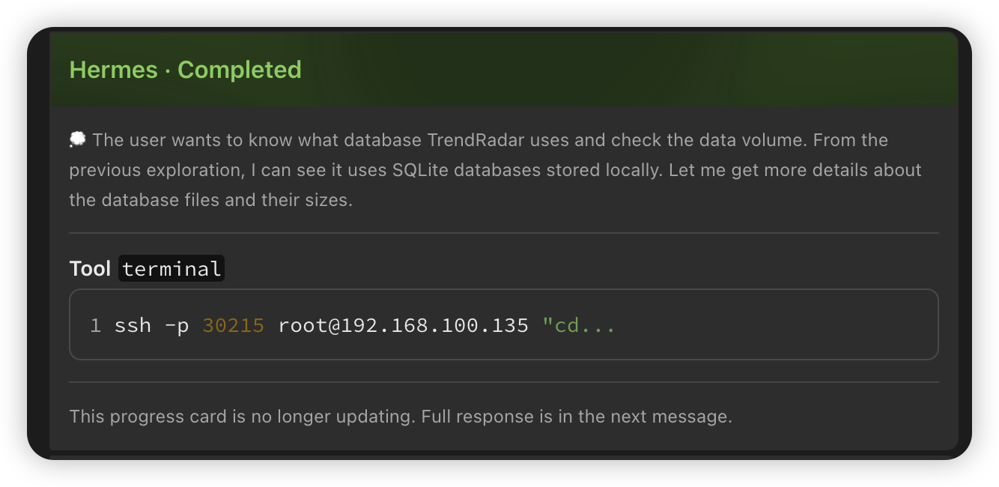

# hermes-feishu-card-progress-plugin

Hermes Agent 插件 — 零代码改动，将飞书消息体验从纯文本升级为交互式卡片。

参考 [cc-connect](https://github.com/anthropics/cc-connect) 的 Feishu 进度卡片 UI 实现，为 Hermes gateway 提供一致的卡片体验。

## 效果对比

### Before（Hermes 原始样式）



### After（安装插件后）



## 功能

### 1. 工具执行进度卡片

原始体验：每执行一个工具，发一条文本消息 "⚙️ bash: ls"，刷屏且不可编辑。

安装后：自动创建一张进度卡片，随工具执行 **实时更新**（Patch API），不再刷屏。

- 卡片 header 实时显示状态：🔵 Running → 🟢 Completed / 🔴 Failed
- 每个工具调用使用 `<text_tag color='blue'>Tool</text_tag>` 彩色标签 + 参数预览
- Bash/Shell 命令自动包装为 ` ```bash ``` ` 代码块
- 超过 10 个工具时自动截断，显示 "Showing latest updates only"
- 无工具调用的会话，卡片静默删除，不留垃圾消息

### 2. Thinking/Reasoning 实时显示

模型的推理过程实时显示在进度卡片中：

- 灰色 notation 文本 + 💭 前缀，与工具条目视觉区分
- 只保留最新一条 reasoning（避免卡片过长）
- 不触发卡片创建（仅工具调用创建卡片，避免竞态）
- 支持 DeepSeek / Qwen / Moonshot / OpenRouter 等多 provider 的 reasoning 格式
- Reasoning 内容会从最终响应中自动剥离（双重机制：正则匹配 + 文本回退）

### 3. Markdown 响应增强渲染

原始体验：Hermes 回复用 `post` 格式渲染 Markdown，表格错位、代码块样式粗糙。

安装后：所有含 Markdown 语法的响应自动使用 **Schema 2.0 卡片**渲染：

- 表格对齐更精确
- 代码块样式更清晰
- 链接渲染更美观
- 无多余 header，直接展示内容

### 4. 网关重启容错

- 活跃卡片 ID 持久化到 `feishu_active_cards.json`
- 网关重启后自动清理上次的遗留 "Running" 卡片
- 防止用户看到永远无法完成的进度卡片

### 5. 完全自包含

- **零代码改动** — 纯 monkey-patching，不修改 Hermes 任何核心文件
- 通过 `FEISHU_PROGRESS_STYLE=card` 环境变量开关
- 未设置时插件静默加载，不影响原有行为

## 安装

### 1. 复制插件目录

```bash
cp -r feishu-card-progress ~/.hermes/plugins/
```

### 2. 启用插件

在 profile 的 `config.yaml` 中启用插件：

```yaml
# ~/.hermes/profiles/<your-profile>/config.yaml
plugins:
  enabled:
    - feishu-card-progress
```

### 3. 设置环境变量

在 profile 的 `.env` 文件中添加：

```bash
# ~/.hermes/profiles/<your-profile>/.env
FEISHU_PROGRESS_STYLE=card
```

### 4. Profile 模式额外步骤

如果使用 `--profile` 运行 gateway，需要将插件链接到 profile 的 plugins 目录：

```bash
mkdir -p ~/.hermes/profiles/<your-profile>/plugins
ln -s ~/.hermes/plugins/feishu-card-progress ~/.hermes/profiles/<your-profile>/plugins/
```

> **原因**：`--profile` 模式会将 `HERMES_HOME` 设为 `~/.hermes/profiles/<name>`，
> 插件发现路径也随之变为 `<profile>/plugins/`。符号链接确保 profile 也能找到插件。

### 5. 重启网关

```bash
hermes gateway restart
```

## 工作原理

插件通过 monkey-patching 在运行时扩展 `FeishuAdapter` 和 `Agent`：

| 补丁对象 | 方法 | 行为 |
|----------|------|------|
| FeishuAdapter | `on_processing_start` | 清理遗留卡片，重置状态 |
| FeishuAdapter | `on_processing_complete` | 完成卡片（绿色/红色 + 页脚） |
| FeishuAdapter | `send()` | 拦截首个进度消息 → 创建卡片 |
| FeishuAdapter | `edit_message()` | 拦截后续进度更新 → PATCH 卡片 |
| FeishuAdapter | `_build_outbound_payload` | Markdown 响应使用卡片格式 |
| Agent | `__setattr__` | 拦截 `tool_progress_callback` 赋值，包装 reasoning 事件路由 |

进度消息通过 emoji 前缀检测（`⚙️`、`🔍` 等），与网关的 `progress_callback` 格式匹配。

Reasoning 事件通过 Agent 层拦截：当 gateway 将 `progress_callback` 赋给
`agent.tool_progress_callback` 时，插件自动包装该回调，在 `reasoning.available`
事件到达 gateway 的过滤逻辑之前将其路由到卡片 handler。由于 agent 在线程池中
运行而 gateway 在主线程事件循环中，使用 `asyncio.run_coroutine_threadsafe`
跨线程调度卡片更新。

## 与 cc-connect 的对比

参考 [cc-connect](https://github.com/anthropics/cc-connect) 的 Feishu 卡片实现（`platform/feishu/feishu.go`）：

### 卡片结构对比

两者都使用 Feishu Schema 2.0 交互式卡片：

```
┌──────────────────────────────────────────────────┐
│ Agent · Running / Completed / Failed             │  ← header (blue/green/red)
├──────────────────────────────────────────────────┤
│ 💭 Thinking content...                           │  ← grey notation, 仅最新一条
│ ─────────────────────────────────────────────── │
│ **Tool** `bash`                                  │  ← 蓝色 text_tag (cc-connect)
│ ```bash                                          │
│ ls -la                                           │
│ ```                                              │
│ ─────────────────────────────────────────────── │
│ This progress card is no longer updating...      │  ← footer (完成/失败后)
└──────────────────────────────────────────────────┘
```

### 功能对齐

| 状态 | 功能 | cc-connect | 本插件 | 说明 |
|------|------|:----------:|:------:|------|
| ✅ | 进度卡片 | `buildProgressCardJSONFromPayload` | `_send_progress_card` | 实时更新的交互式卡片 |
| ✅ | 卡片 header 颜色 | blue/green/red | blue/green/red | Running/Completed/Failed |
| ✅ | 工具预览 | `formatProgressToolInput` | `_format_tool_input` | bash code block、文本截断 |
| ✅ | Thinking 显示 | `ProgressEntryThinking` | `on_thinking` | 灰色 notation + 💭 前缀 |
| ✅ | Reasoning 剥离 | N/A (引擎层处理) | `_REASONING_PREFIX_RE` | 从最终响应中剥离 |
| ✅ | 卡片持久化 | `ProgressCardPayload` | `feishu_active_cards.json` | 网关重启后清理遗留卡片 |
| ✅ | Markdown 卡片渲染 | `renderCardMap` | `_patched_build_outbound_payload` | Schema 2.0 卡片 |
| ✅ | 截断提示 | "Showing latest updates only" | 同 cc-connect | 超 10 条自动截断 |
| ✅ | Footer 提示 | "no longer updating" | 同 cc-connect | 完成/失败后显示 |
| ✅ | text_tag 彩色标签 | `<text_tag color='blue'>` | `<text_tag color='blue'>` | 蓝色 Tool、红色 Error |
| ❌ | ToolResult 条目 | `ProgressEntryToolResult` | 无 | 显示工具执行结果 + 状态点 |
| ✅ | Error 条目 | `ProgressEntryError` | `<text_tag color='red'>` | 红色错误标签 |
| ❌ | i18n | 中英文自动切换 | 英文 | cc-connect 根据语言切换文案 |
| ❌ | TodoWrite 格式化 | `formatTodoWriteInput` | 无 | 将 TODO JSON 渲染为列表 |
| ❌ | 流式文本预览 | `streamPreview` | 无 | 实时流式显示响应 |
| ❌ | Done 表情推送 | ✅ 推送完成表情 | 无 | 完成后推送表情反馈 |
| ❌ | Schema V1 回退 | `renderCardMap` 双格式 | 仅 Schema 2.0 | cc-connect 支持 v1 卡片 |

### 关键差异

1. **text_tag 彩色标签**：本插件已使用 `<text_tag color='blue'>Tool</text_tag>` 彩色标签，与 cc-connect 风格一致
2. **ToolResult 显示**：cc-connect 在工具执行后显示结果条目（带 🟢/🔴 状态点），本插件仅显示工具调用
3. **i18n**：cc-connect 根据用户语言自动切换中英文（"进行中"/"Running"、"已完成"/"Completed"），本插件固定英文
4. **entry 类型**：cc-connect 区分 5 种类型（info/thinking/tool_use/tool_result/error），本插件 3 种（thinking/tool_use/error）

## 文件结构

```
feishu-card-progress/
├── plugin.yaml          # 插件清单
├── __init__.py          # 注册函数 + monkey-patching
├── card_handler.py      # FeishuCardHandler 核心逻辑
├── assets/              # 效果截图
│   ├── before.png       # cc-connect 原始效果
│   └── after.png        # 本插件效果
└── README.md            # 本文件
```

## Reasoning / Thinking

Hermes 原生支持 reasoning 配置：

```yaml
# profile config.yaml
agent:
  reasoning_effort: medium    # 推理深度: low / medium / high

display:
  show_reasoning: true        # CLI 中显示推理过程
```

模型的 reasoning 内容通过多种格式返回：

| 格式 | Provider | 说明 |
|------|----------|------|
| `message.reasoning` | DeepSeek, Qwen | 直接字段 |
| `message.reasoning_content` | Moonshot AI, Novita | 替代字段名 |
| `message.reasoning_details` | OpenRouter (unified) | `{type, summary}` 数组 |

Hermes 的 `_extract_reasoning()` 函数（`run_agent.py`）会依次尝试以上格式，
最后回退到从 `content` 中提取 `<think...</think*>` 标签内容。

Reasoning 内容会实时显示在进度卡片中（灰色 notation + 💭 前缀），只保留
最新一条，不触发卡片创建（仅 tool_use 事件创建卡片，避免竞态条件）。

## 依赖

- Hermes Agent >= 最新版本（需要插件系统支持）
- `lark_oapi` Python SDK（飞书官方 SDK）
- 飞书平台适配器已配置（`FEISHU_APP_ID`、`FEISHU_APP_SECRET`）

## 许可

MIT
