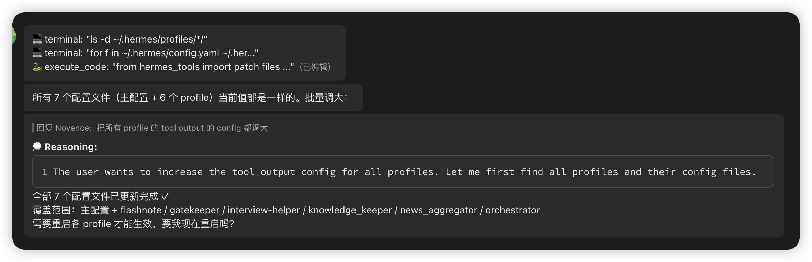
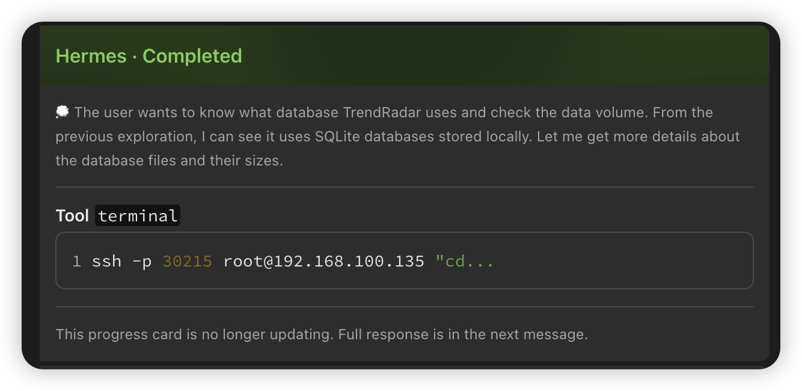

# feishu-card-progress

Hermes 飞书插件 — 工具执行进度卡片 + Schema 2.0 响应渲染。

参考 [cc-connect](https://github.com/anthropics/cc-connect) 的 Feishu 进度卡片 UI 实现。

## 效果

 

## 功能

- **进度卡片** — 自动创建、实时 Patch 更新，不再刷屏。Header 状态：🔵 Running → 🟢 Completed / 🔴 Failed
- **最终回复标识** — 处理完成后 retroactively patch 最终回复卡片，添加 🟣 Response header，与状态卡片明确区分
- **Thinking 显示** — 灰色 💭 notation，支持 DeepSeek/Qwen/Moonshot/OpenRouter 等多 provider
- **Schema 2.0 渲染** — Markdown 响应自动转为交互式卡片，表格/代码块/链接格式更精确
- **表格溢出处理** — 超过 5 个 markdown 表格时自动分片（split）或回退 Post 消息（post），避免飞书 ErrCode 11310
- **Reply Chain 增强** — 引用卡片消息时提取实际文本内容，不再显示 `[Interactive message]`
- **root_id 自动清除** — 防止引用回复自动创建话题，Hermes 更新后不会复发
- **运行统计 Footer** — 最终回复卡片自动展示耗时、模型、工具调用次数、token 用量（如 `⏱ 4.2s · 🤖 claude-sonnet-4-6 · 🔧 5 calls · bash ×3 · ↑1.2k ↓320 tokens`）
- **`<think>` 标签兜底** — DeepSeek/Qwen/Moonshot 等模型偶发泄漏的 `<think>`/`<thinking>` 标签自动剥离
- **PATCH 并发安全** — per-chat 锁 + 序号 stale-drop，避免 tool 密集场景下旧快照覆盖新内容
- **重启容错** — 活跃卡片 ID 持久化，重启后自动清理遗留卡片

## 安装

```bash
# 1. 复制插件
cp -r feishu-card-progress ~/.hermes/plugins/feishu-card-progress

# 2. Profile 模式需要额外链接
ln -s ~/.hermes/plugins/feishu-card-progress ~/.hermes/profiles/<profile>/plugins/

# 3. 启用插件（profile config.yaml）
# plugins:
#   enabled:
#     - feishu-card-progress

# 4. 打上游补丁（1 处，在 gateway/platforms/feishu.py）
# 去掉 root_id 作为 thread_id/reply_to 的 fallback，防止自动创建话题

# 5. 重启
hermes gateway restart
```

## 配置

| 环境变量 | 默认值 | 说明 |
|----------|--------|------|
| `FEISHU_PROGRESS_STYLE` | — | 设为 `card` 激活插件，未设置则静默加载 |
| `FEISHU_PROGRESS_RESPONSE_HEADER` | `true` | 设为 `false` 关闭最终回复的 turquoise Response header |
| `FEISHU_PROGRESS_TABLE_OVERFLOW` | `split` | `split` 多卡片分片（≤5 表/卡），`post` 回退 Feishu Post 消息（无表格限制） |

## 上游更新

Hermes `git pull` 后检查 1 处补丁是否被覆盖：

```bash
cd ~/.hermes/hermes-agent && git pull origin main
# 检查 feishu.py 中 root_id 是否仍作为 thread_id/reply_to 的 fallback
grep -n 'root_id' gateway/platforms/feishu.py | grep -i 'thread_id\|reply_to'
# 若有结果则需重新打补丁
```

或直接让 AI 执行：**"Hermes 更新了，帮我重新打 feishu-card 的补丁"**

详见 `skills/patch-upstream/SKILL.md`。

## Monkey-patch 列表

### FeishuAdapter（8 处）

| 方法 | 行为 |
|------|------|
| `on_processing_start` | 清理遗留卡片，重置状态 |
| `on_processing_complete` | 完成进度卡片（绿/红 header + 页脚）+ retroactively patch 最终回复加 Response header |
| `_on_message_event` | 清除 `root_id`，防止引用回复自动创建话题 |
| `send()` | 拦截进度消息 → 创建卡片；多表格分片发送；追踪 response payload 和 msg_id |
| `edit_message()` | 拦截进度更新 → PATCH 卡片 |
| `_build_outbound_payload` | Schema 2.0 卡片渲染；追踪 interactive payload |
| `_build_get_message_request` | 增加 `card_msg_content_type=raw_card_content` 参数 |
| `_extract_text_from_raw_content` | 解析 interactive 卡片，提取引用文本 |

### AIAgent（2 处）

| 方法 | 行为 |
|------|------|
| `__setattr__` | 包装 `tool_progress_callback`，路由 reasoning 事件 |
| `_build_assistant_message` | 拦截 reasoning 提取 → 卡片 |

### 上游补丁（1 处）

| 文件 | 行为 |
|------|------|
| `feishu.py:2977` | 去掉 `root_id` 作为 `thread_id`/`reply_to_message_id` 的 fallback |

## 卡片样式

| 卡片类型 | Header | 颜色 |
|---------|--------|------|
| 进度（执行中） | `Hermes · Running` | blue |
| 进度（完成） | `Hermes · Completed` | green |
| 进度（失败） | `Hermes · Failed` | red |
| 最终回复 | `Hermes · Response` | turquoise |

## 与 cc-connect 对比

| 功能 | cc-connect | 本插件 |
|------|-----------|--------|
| 进度卡片 | Schema 2.0 | Schema 2.0 |
| Reasoning 显示 | 卡片内 | 卡片内 |
| 最终回复标识 | — | turquoise Response header |
| 网关重启容错 | 无 | 持久化 + 自动清理 |
| 运行统计 footer | — | ⏱🤖↑↓ |
| `<think>` 兜底过滤 | — | ✓ |
| PATCH 串行 + stale-drop | — | ✓ |
| 流式文本预览 | 有 | — |
| TodoWrite 图标 | 有 | — |

## 依赖

- Hermes Agent（需要插件系统支持）
- `lark_oapi` SDK
- 飞书平台已配置（`FEISHU_APP_ID` / `FEISHU_APP_SECRET`）

## 许可

MIT
