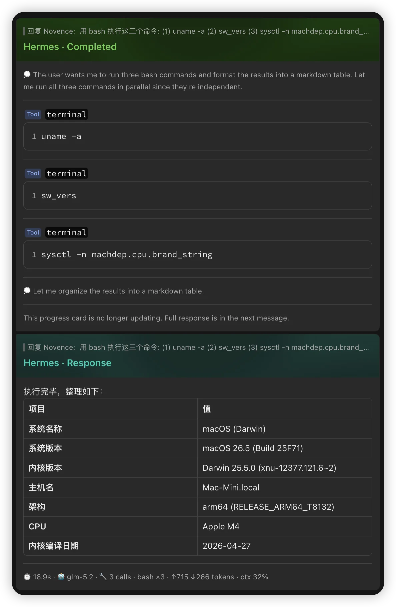

# feishu-card-progress

[English](README.en.md) | 中文

<p align="center">
  
</p>

> **Hermes 飞书插件** —— 把工具执行进度与最终回复渲染成**实时更新的交互式卡片**，告别文本刷屏。纯 monkey-patch 架构，零额外进程，开箱即用。

<p align="center">
  
</p>

<sub>一张图展示全部能力：上方 🟢 <code>Completed</code> 进度卡片（💭 思考过程 + 🖥 工具调用步骤）→ 下方 🟦 <code>Response</code> 回复卡片（底部 <code>⏱ 🤖 🔧 ↑↓ ctx</code> 运行统计 footer）。</sub>

---

## ✨ 核心功能

- **实时进度卡片** —— 工具执行自动创建卡片、增量 Patch 更新，不再逐条刷屏。Header 状态：🔵 Running → 🟢 Completed / 🔴 Failed
- **最终回复标识** —— 处理完成后 retroactively patch 最终回复卡片，加 🟦 turquoise `Response` header，与进度卡片明确区分
- **思考过程展示** —— 灰色 💭 notation，支持 DeepSeek / Qwen / Moonshot / GLM / OpenRouter 等多 provider 的 reasoning 增量
- **Schema 2.0 卡片渲染** —— Markdown 回复自动转交互式卡片，表格 / 代码块 / 链接格式更精确
- **运行统计 Footer** —— 回复卡片底部展示耗时、模型、工具调用次数（含 bash 拆分）、token 用量、上下文占比
  - 示例：`⏱ 4.2s · 🤖 glm-5.1 · 🔧 5 calls · bash ×3 · ↑1.2k ↓320 tokens · ctx 42%`
  - **token 估算兜底** —— z.ai / GLM 等 streaming 不返回 usage 的 provider，自动从 context compressor 估算，不再显示无意义的 `↑0 ↓0`
- **`<think>` 标签兜底** —— DeepSeek / Qwen 等模型偶发泄漏的 `<think>` / `<thinking>` 标签自动剥离
- **PATCH 并发安全** —— per-chat 锁 + 单调序号 stale-drop，工具密集场景下旧快照不会覆盖新内容
- **表格溢出保护** —— 超 5 个 markdown 表格时自动分片（split）或回退 Post 消息（post），避开飞书 ErrCode 11310
- **重启容错** —— 活跃卡片 ID 持久化，gateway 重启后自动清理遗留卡片
- **Reply Chain 增强** —— 引用卡片消息时提取实际文本，不再显示 `[Interactive message]`
- **root_id 自动清除** —— 防止引用回复自动创建话题

## 📦 安装

```bash
# 1. 复制插件到 Hermes 插件目录
cp -r feishu-card-progress ~/.hermes/plugins/feishu-card-progress

# 2. Profile 模式需要额外软链接
ln -s ~/.hermes/plugins/feishu-card-progress ~/.hermes/profiles/<profile>/plugins/

# 3. 启用插件（profile config.yaml）
# plugins:
#   enabled:
#     - feishu-card-progress

# 4. 打上游补丁（1 处，在 gateway/platforms/feishu.py）
#    去掉 root_id 作为 thread_id / reply_to 的 fallback，防止自动创建话题

# 5. 重启 gateway
hermes gateway restart
```

## ⚙️ 配置

| 环境变量 | 默认值 | 说明 |
|----------|--------|------|
| `FEISHU_PROGRESS_STYLE` | — | 设为 `card` 激活插件，未设置则静默加载 |
| `FEISHU_PROGRESS_RESPONSE_HEADER` | `true` | 设为 `false` 关闭最终回复的 turquoise Response header |
| `FEISHU_PROGRESS_TABLE_OVERFLOW` | `split` | `split` 多卡片分片（≤5 表/卡）；`post` 回退 Feishu Post 消息（无表格限制） |

## 🏗 架构

纯 monkey-patch，不引入 sidecar 或额外进程，直接增强 Hermes 自身的 `FeishuAdapter` / `AIAgent`：

```text
用户消息
  │
  ▼
Hermes Gateway
  ├─ FeishuAdapter（8 处 patch）
  │   ├─ on_processing_start          清理遗留卡片 + 重置状态
  │   ├─ on_processing_complete       完成进度卡片 + retroactively 加 Response header + 渲染 footer
  │   ├─ _on_message_event            清除 root_id，防止自动创建话题
  │   ├─ send()                       拦截进度消息 → 创建卡片；多表格分片；追踪回复 msg_id
  │   ├─ edit_message()               拦截进度更新 → PATCH 卡片（per-chat 锁 + seq stale-drop）
  │   ├─ _build_outbound_payload      Schema 2.0 卡片渲染 / Post 回退
  │   ├─ _build_get_message_request   加 raw_card_content 参数
  │   └─ _extract_text_from_raw_content 解析卡片提取引用文本
  ├─ AIAgent（2 处 patch）
  │   ├─ __setattr__                  捕获 agent 实例 + 包装 tool_progress_callback（路由 reasoning）
  │   └─ _build_assistant_message     拦截 reasoning 提取
  └─ 上游补丁（1 处）
      └─ feishu.py                    去掉 root_id 作为 thread_id / reply_to 的 fallback
```

事件流：`reasoning.available` / `tool_progress` → 进度卡片增量 PATCH → `on_processing_complete` → 最终回复 → retroactively patch Response header + footer。

## 🎨 卡片样式

| 卡片类型 | Header | 颜色 |
|---------|--------|------|
| 进度（执行中） | `Hermes · Running` | 🔵 blue |
| 进度（完成） | `Hermes · Completed` | 🟢 green |
| 进度（失败） | `Hermes · Failed` | 🔴 red |
| 最终回复 | `Hermes · Response` | 🟦 turquoise |

## ❓ FAQ

- **卡片不更新 / 不流式** —— 确认 Hermes `streaming.enabled: true` 且 `streaming.transport: edit`；模型需支持 reasoning 增量。
- **footer token 显示为 0** —— provider（z.ai / GLM）streaming 未返回 usage，v1.4.0 已加估算兜底（从 `context_compressor.last_prompt_tokens` 估算 input，回复字符数 ÷ 4 估算 output）。
- **工具密集时卡片内容闪烁回退** —— v1.4.0 的 per-chat PATCH 锁 + 序号 stale-drop 已修复；确认插件已更新到 v1.4.0。
- **多表格回复发送失败（ErrCode 11310）** —— 超飞书 5 表限制，设 `FEISHU_PROGRESS_TABLE_OVERFLOW=post` 回退 Post 消息。
- **最终回复泄漏 `<think>` 标签** —— v1.4.0 已加 `_strip_think_tags` 兜底剥离。
- **Hermes 更新后补丁失效** —— 见下方「上游更新」，重新打 feishu.py 的 1 处补丁。

## 🔧 上游更新

Hermes `git pull` 后检查 1 处补丁是否被覆盖：

```bash
cd ~/.hermes/hermes-agent && git pull origin main
grep -n 'root_id' gateway/platforms/feishu.py | grep -iE 'thread_id|reply_to'
# 若有结果则需重新打补丁
```

或直接让 AI 执行：**"Hermes 更新了，帮我重新打 feishu-card 的补丁"**。详见 `skills/patch-upstream/SKILL.md`。

## 📊 与 cc-connect 对比

| 功能 | cc-connect | 本插件 |
|------|-----------|--------|
| 进度卡片 | Schema 2.0 | Schema 2.0 |
| Reasoning 显示 | 卡片内 | 卡片内 |
| 最终回复标识 | — | 🟦 turquoise Response header |
| 网关重启容错 | 无 | 持久化 + 自动清理 |
| 运行统计 footer | — | ⏱🤖🔧↑↓ctx |
| token 估算兜底 | — | ✓（GLM / z.ai） |
| `<think>` 兜底过滤 | — | ✓ |
| PATCH 串行 + stale-drop | — | ✓ |
| 表格溢出保护 | — | ✓（split / post） |
| 流式文本预览 | 有 | — |
| TodoWrite 图标 | 有 | — |

## 📜 版本历史

| 版本 | 日期 | 重点 |
|------|------|------|
| v1.4.0 | 2026-06-19 | 运行统计 footer、token 估算兜底、`<think>` 过滤、PATCH 并发锁 |
| v1.3.0 | 2026-05-23 | turquoise Response header、表格溢出处理 |
| v1.2.0 | 2026-05-22 | reply-to、root_id 清除、clarify 抑制 |
| v1.1.0 | 2026-05-21 | thinking / reasoning 支持 |
| v1.0.0 | 2026-05-20 | 初始交互式卡片进度 |

完整更新日志见 [CHANGELOG.md](CHANGELOG.md)。

## 🧪 测试

```bash
python3 -m unittest tests.test_card_handler -v
```

覆盖 `<think>` 剥离、PATCH seq stale-drop、footer 渲染（stdlib `unittest`，无 pytest 依赖）。

## 📦 依赖

- Hermes Agent（需插件系统支持）
- `lark_oapi` SDK
- 飞书应用已配置（`FEISHU_APP_ID` / `FEISHU_APP_SECRET`）

## 📄 License

[MIT](LICENSE) © 2026 Novence
